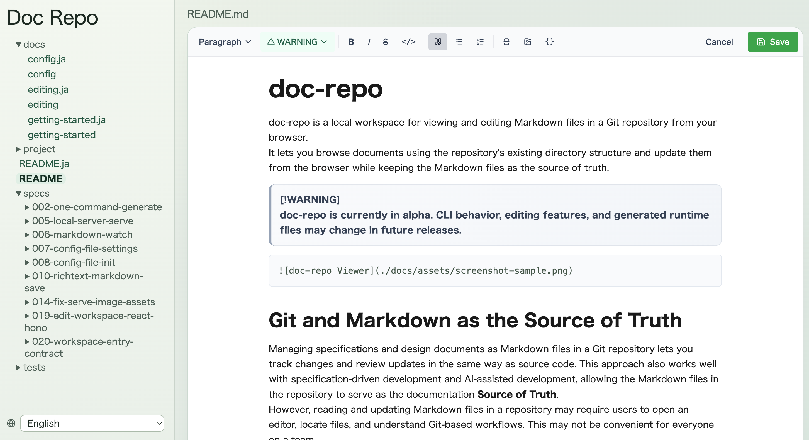

# doc-repo

doc-repo is a documentation management tool for browsing and editing repository Markdown files in a browser while keeping Git and Markdown as the source of truth.

> [!WARNING]
> `doc-repo` is currently in alpha. CLI arguments and generated file structure may change in future releases.



## Why doc-repo?

Spec-driven development and AI-assisted development make it increasingly common to keep specs, design notes, meeting notes, and operational docs as Markdown in a repository. As those documents grow across directories, they become harder for everyone on a team to use.

- Markdown files are scattered across multiple directories.
- It is hard to browse content across files without opening an editor.
- It is difficult for non-developers to find and update documents through VS Code or Git.

doc-repo reads Markdown files from the repository, keeps the directory structure visible, and presents them as a two-pane browser workspace (left tree / right content). Documents can be edited in the browser and saved back to the original Markdown files, so non-developers can work with repository docs in a familiar OneNote- or Confluence-like flow.

The core concept is not simply converting Markdown to HTML. doc-repo keeps Git and Markdown as the canonical source while making repository documents readable and editable by people across roles.

## Features

- Recursively discovers `.md` files in your repository
- Preserves directory structure in tree navigation
- Provides a browser-based document workspace for repository Markdown
- Saves browser edits back to the original Markdown files
- Supports local server mode (`doc-repo serve`)
- Watches Markdown files while `serve` is running
- Reloads the browser automatically via SSE when a Markdown change is detected

> [!IMPORTANT]
> As of task 020 policy, direct static-generation entry (`doc-repo [scopePath]`) is retired.
> The only supported entry point is `doc-repo serve`.

## Quick Start

Prerequisite:

- Node.js 20+

Run inside a repository:

```bash
npx doc-repo serve
```

If the package is published under an alpha tag, use:

```bash
npx doc-repo@alpha serve
```

Then open `http://localhost:4000` in your browser.

## Viewer Language

The Viewer UI is available in English and Japanese. Use the globe menu fixed at the bottom of the left sidebar to switch languages.

The default language is English. Your selected language is saved in the browser's `localStorage` and is restored when you reload the page. This changes only the Viewer UI; CLI messages, Markdown content, and repository structure are not translated.

## CLI

```bash
doc-repo init
doc-repo serve [--port <number>]
```

| Argument / Option | Description                                                   | Default |
| ----------------- | ------------------------------------------------------------- | ------- |
| `init`            | Generate `doc-repo.config.json` template in current directory | -       |
| `serve`           | Start local server and watch for changes                      | -       |
| `--port`          | Port for `serve` (CLI > config > default)                     | `4000`  |

### Serve Responsibilities

- `doc-repo serve` orchestrates: server start → file watch start
- Watches `.md` files and dispatches browser reload via SSE on change, add, or unlink
- The HTTP server serves Viewer assets and workspace files on one origin
- On exit (Ctrl+C / SIGTERM), stops in order: watcher → SSE connections → HTTP server

### Target Root

- Target root: resolved from `doc-repo.config.json` if present; falls back to Git root, then current directory
- Collection target: all Markdown files under target root (filtered by `include`/`exclude`)

## Configuration File

For full configuration details and validation rules, see [docs/config.md](./docs/config.md).

Create `doc-repo.config.json` in your repository root to configure behavior:

```json
{
  "name": "Doc Repo",
  "rootDir": "./docs",
  "include": ["specs/**/*.md"],
  "exclude": ["drafts/**"],
  "port": 4000
}
```

| Field     | Type       | Default        | Description                                                        |
| --------- | ---------- | -------------- | ------------------------------------------------------------------ |
| `name`    | `string`   | `"Doc Repo"`   | Site name shown in the sidebar header                              |
| `rootDir` | `string`   | Git root / cwd | Root directory for Markdown collection (relative to config file)   |
| `include` | `string[]` | `["**/*.md"]`  | Glob patterns to include. `[]` is treated the same as omitted.     |
| `exclude` | `string[]` | `[]`           | Additional glob patterns to exclude (merged with default excludes) |
| `port`    | `number`   | `4000`         | Port for `serve` command (overridden by `--port` CLI option)       |

**Resolution order**: config file (`doc-repo.config.json`) → Git root → current directory.

**Default excludes** (always active): `node_modules/**`, `.git/**`, `.doc-repo/**`

**`exclude` takes precedence over `include`.**

## Output

doc-repo prepares runtime artifacts under `.doc-repo` for `serve` execution:

```text
.doc-repo/
├── index.html        # serve entry page
├── assets/
├── viewer/
└── ...
```

Generated artifacts are intended to be consumed through `doc-repo serve`.

Reliability behavior:

- Serves Viewer assets and API on the same origin/port
- Guards against path traversal when serving workspace files
- Returns structured JSON errors for API failures

### Exit Codes

| Code | Meaning                                   |
| ---- | ----------------------------------------- |
| `0`  | Success (including success with warnings) |
| `1`  | Failure                                   |

## Markdown Support (Current)

- Converter: `markdown-it`
- `html: false` (raw HTML in Markdown is disabled)
- `linkify: true`, `typographer: true`
- Some GFM extensions (task lists, Mermaid, code highlighting) are not yet supported
- Relative images are rewritten to workspace-relative asset paths and served via `serve`

## Edit and Save Workflow

- Click `編集` in the viewer to switch the current document to rich text edit mode
- Supported formatting: body text, headings 1-6, bold, italic, strikethrough, inline code, blockquote, bullet list, ordered list, code block, horizontal rule
- Save request is validated against root/include/exclude/path traversal and `.md` extension rules
- If unsupported markdown segments are detected, a warning dialog is shown before continuing save
- Save failures are categorized and shown with retry guidance:
  - `invalid-target` (not retryable)
  - `unwritable-target` (not retryable until environment is fixed)
  - `transient-io` (retryable)
- Unsaved edits are guarded on document switch, edit exit, and browser unload

### Editing Shortcuts

| Action          | macOS      | Windows / Linux |
| --------------- | ---------- | --------------- |
| Body text       | `⌘⌥0`      | `Ctrl+Alt+0`    |
| Heading 1       | `⌘⌥1`      | `Ctrl+Alt+1`    |
| Heading 2       | `⌘⌥2`      | `Ctrl+Alt+2`    |
| Heading 3       | `⌘⌥3`      | `Ctrl+Alt+3`    |
| Heading 4       | `⌘⌥4`      | `Ctrl+Alt+4`    |
| Heading 5       | `⌘⌥5`      | `Ctrl+Alt+5`    |
| Heading 6       | `⌘⌥6`      | `Ctrl+Alt+6`    |
| Bold            | `⌘B`       | `Ctrl+B`        |
| Italic          | `⌘I`       | `Ctrl+I`        |
| Strikethrough   | `⌘⇧S`      | `Ctrl+Shift+S`  |
| Inline code     | `⌘⇧M`      | `Ctrl+Shift+M`  |
| Blockquote      | `⌘⇧B`      | `Ctrl+Shift+B`  |
| Bullet list     | `⌘⇧8`      | `Ctrl+Shift+8`  |
| Ordered list    | `⌘⇧7`      | `Ctrl+Shift+7`  |
| Code block      | `⌘⌥C`      | `Ctrl+Alt+C`    |
| Horizontal rule | `⌘⇧-`      | `Ctrl+Shift+-`  |
| Save            | `⌘Enter`   | `Ctrl+Enter`    |

## Security Notes

- Raw HTML is disabled, but generation is still intended for trusted repositories
- If you run doc-repo on unknown repositories, review output before sharing

## Git Policy for `.doc-repo`

Choose a policy based on your use case:

- Treat as temporary artifact: add `.doc-repo/` to `.gitignore`
- Treat as distributable artifact: committing generated files is also possible (output is replaced on each successful run)

## Development

For contributors:

```bash
npm install
npm run dev
npm run dev -- serve
npm run build
```

Build and run compiled CLI:

```bash
node dist/cli/index.js
node dist/cli/index.js serve
```

## Markdown Features & Constraints

**Supported**:

- Relative images (e.g., ``): rewritten to `/assets/...` and resolved from workspace files in `serve` mode

**Not yet supported (planned for future releases)**:

- Attachments in Markdown (PDF, CSV, ZIP, etc. referenced via normal links like `[link](./docs/assets/file.pdf)`)

## Issues / Feedback

Please use GitHub Issues for bug reports and feature requests.

## License

MIT
